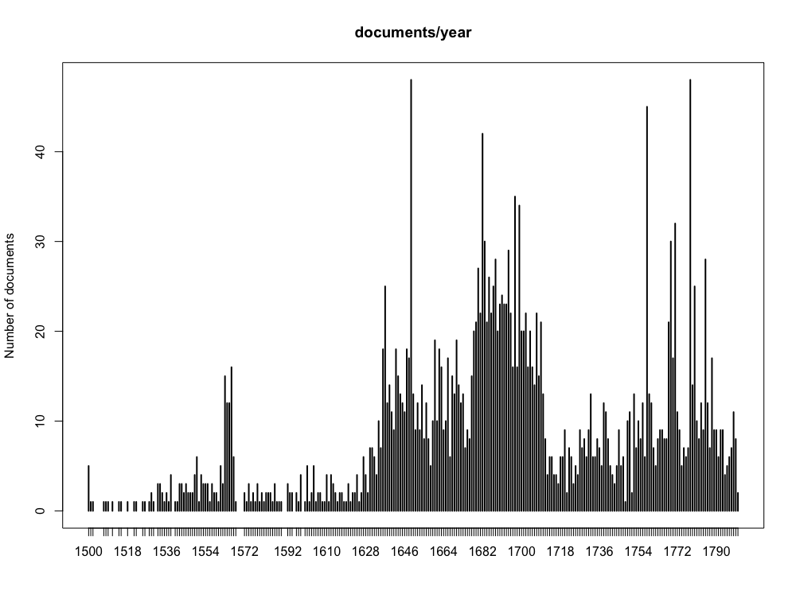
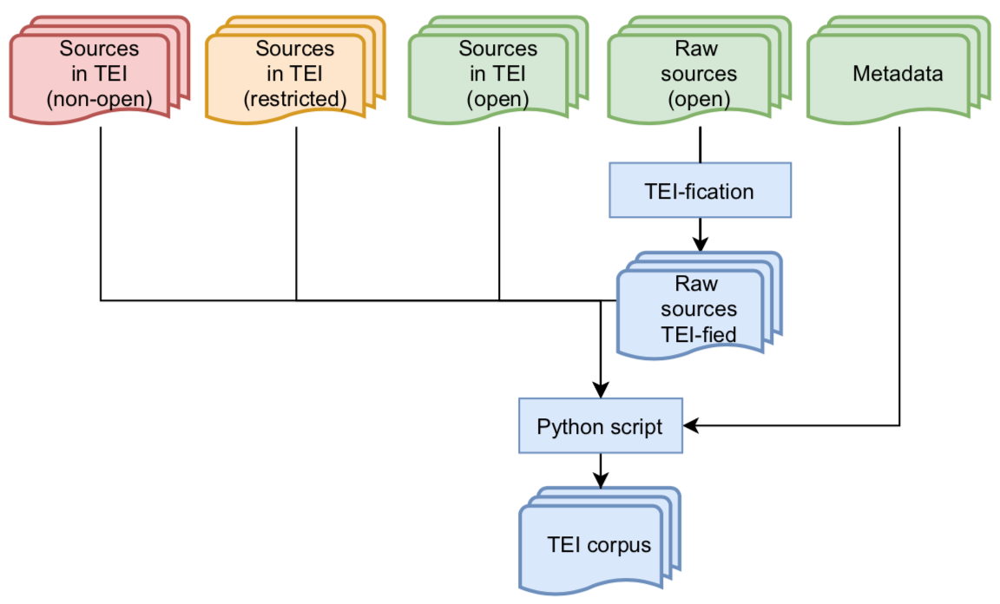

# FreEM<i>max</i>

Usable historical texts are difficult to find because they are more rare than contemporary ones, editors tend to normalise the language (_i.e._ use the spelling conventions of contemporary French), transcriptions are not (always) distributed in a digital format. FreEM<i>max</i> is an attempt to solve this problem: the aim of this dataset is to group together the largest number or texts possible written in Early Modern French.

Because not all sources are open, FreEM<i>max</i> comes two versions: one is restricted, one is open access.

## Publications

Data (GitHub and Zenodo):

* Gabay, Simon, Bartz, Alexandre, Gambette, Philippe, & Chagué, Alix, _FreEM-corpora/FreEMmax_OA: FreEM max OA: A Large Corpus for Early modern French - Open access version (1.0.0)_, GitHub, 2022. https://github.com/FreEM-corpora/FreEMmax_OA.
* Gabay, Simon, Bartz, Alexandre, Gambette, Philippe, & Chagué, Alix, _FreEM-corpora/FreEMmax_OA: FreEM max OA: A Large Corpus for Early modern French - Open access version (1.0.0)_, Zenodo, 2022. [10.5281/zenodo.6481135](https://doi.org/10.5281/zenodo.6481135).

Conference paper:

* Simon Gabay, Pedro Ortiz Suarez, Alexandre Bartz, Alix Chagué, Rachel Bawden, et al.. "From FreEM to D'AlemBERT: a Large Corpus and a Language Model for Early Modern French", _Proceedings of the 13th Language Resources and Evaluation Conference_, European Language Resources Association, Jun 2022, Marseille, France. [⟨hal-03596653⟩](https://hal.inria.fr/hal-03596653).

## Sources

<figure>
	
	<figcaption>Fig.1 - Distribution of the documents in the
FreEM<i>max</i> corpus per year.</figcaption>
</figure>

The texts have a variety of sources, which can be grouped into three main types:

* Two institutional datasets have been used and are non open-sourced:
	- [_FRANTEXT intégral_](https://www.frantext.fr), the biggest database of French texts (only the texts between 1500 and 1800), a very small portion of which is open access: [_FRANTEXT Démonstration_](https://www.frantext.fr/repository/frantext-demo);
	- [_Electronic Enlightenment_](https://www.e-enlightenment.com) an online collection of edited correspondences of the Early Modern period;

* Several come from research projects distributing transcriptions online:
	- The _Antonomaz project_, French mazarinades (https://cahier.hypotheses.org/antonomaz, https://github.com/Antonomaz) ;
	- The II.B section (in French) of the _Actis Pacis Westphalicae, diplomatic letters for the Peace of Westphalia_ (http://kaskade.dwds.de/dstar/apwcf/) ;
	- The _Bibliothèques virtuelles humanistes_, 16th c. French literature (http://www.bvh.univ-tours.fr) ;
	- The _Corpus électronique de la première modernité_, 17th c. French literature (http://www.cepm.paris-sorbonne.fr) ;
	- The _Condé project_, coutumiers normands (https://conde.hypotheses.org)
	- The _Corpus Descartes_, works of René Descartes (https://www.unicaen.fr/puc/sources/prodescartes/) ;
	- The _Bibliothèque dramatique of the CELLF_, 17th c. French plays (http://bibdramatique.huma-num.fr) ;
	- The _Fabula numerica project_, French fables (https://obvil.sorbonne-universite.fr/projets/fabula-numerica) ;
	- The Fonds Boissy, plays of Louis de Boissy (https://www.licorn-research.fr/Boissy.html) ;
	- The _Mercure Galant project_, the famous French gazette and literary magazine between 1672 and 1710 (https://obvil.sorbonne-universite.fr/corpus/mercure-galant) ;
	- The _Rousseau online_ project, works of Jean-Jacques Rousseau (https://www.rousseauonline.ch) ;
	- The _Sermo project_, sermons of the 16th and 17th c. (http://sermo.unine.ch);
	- The Théâtre classique project, 17th and 18th c. French plays (http://www.theatre-classique.fr) ;

* Additional sources come from researchers who kindly accepted to offer their personal transcriptions or data scrapped by our team:
	- Transcriptions of Anne-Elisabeth Spica (17th c. French novels);
	- Transcriptions found on Wikisource (https://fr.wikisource.org) ;
	- Transcriptions (ePub files) found on Gallica (https://gallica.bnf.fr) ;
	- Transcriptions found on various websites online

## Building the corpus

For legal reasons, it is impossible to distribute some TEI files that require modifications.

<figure>
	
	<figcaption>Fig.2 - FreEM<i>max</i> compilation pipeline.</figcaption>
</figure>

All files are kept in their original format. Metadata is manually prepared in separate files in order to automatically transform and clean (in blue) all the available documents into XML TEI files following the same encoding. It allows us to distribute open data (in green) but also data distributed with restrictions regarding the modification of the original format (in orange). Non-open texts (in red) are not distributed.
