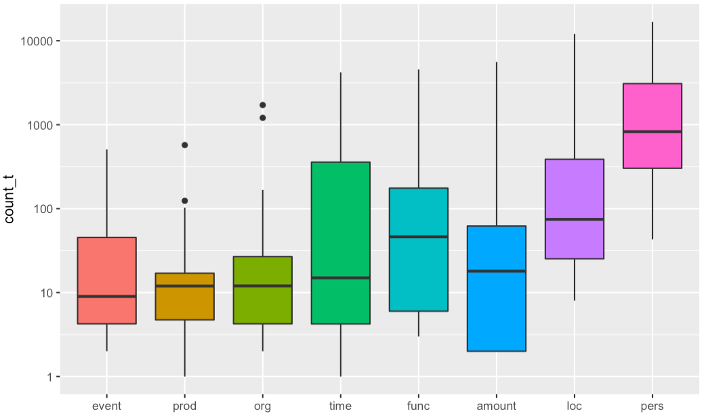
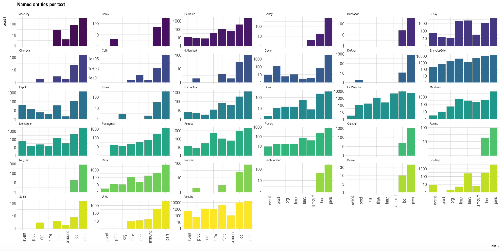

# FreEM<i>NER</i>

FreEM<i>NER</i> is a manually annotated corpus for named entity recognition. It is closely linked to [FreEM<i>LPM</i> ](https://freem-corpora.github.io/corpora/lpm/), from which it is derived.

## Publications

Data (GitHub and Zenodo):

* Gabay, Simon, Thibault Clérice, Matthias Gille Levenson, Jean-Baptiste Camps, Jean-Baptiste Tanguy, _FreEM-corpora/FreEMlpm: FreEM LPM (Lemma, POS-tags, Morphology) corpus (4.0.1)_, GitHub, 2022, [https://github.com/FreEM-corpora/FreEMlpm](https://github.com/FreEM-corpora/FreEMlpm).
* Gabay, Simon, Thibault Clérice, Matthias Gille Levenson, Jean-Baptiste Camps, Jean-Baptiste Tanguy, _FreEM-corpora/FreEMlpm: FreEM LPM (Lemma, POS-tags, Morphology) corpus (4.0.1)_, Zenodo, 2022, [doi.org/10.5281/zenodo.6481300](https://doi.org/10.5281/zenodo.6481300).

## Corpus

<figure>
	
	<figcaption>Fig.1 - Number of entities per text in the
FreEM<i>NER</i> corpus.</figcaption>
</figure>

Rather than designing a new corpus, we have decided to use a subpart of the “core corpus” of the [_Presto project_](http://presto.ens-lyon.fr/?page_id=48), namely the text written during the French _Ancien Régime_ (c. 15th-18th c., _i.e._ 34 texts). This choice is driven by our will to limit the number of annotated corpora for historical French, the same set of documents having already been abundantly corrected to [train a lemmatizer](https://freem-corpora.github.io/corpora/lpm/), but also to avoid a complex selection of works supposed to ensure a relative representativeness of literary documents from the _Ancien Régime_, already perfectly done by our colleagues.

The number of genres covered is extremely large: poetry, drama, novel, correspondence, grammar, philosophy, short stories, encyclopedic literature, etc. and guarantees, here again, a reasonable representativeness of the range of possibilities of Belles-Lettres. The corpus is balanced regarding the distribution per century (c. 10/century) but not regaring the length of the texts, which increases over time (cf. fig. 1), following a possible trend in literature

## Annotation

<figure>
	
	<figcaption>Fig.2 - Number of entities per text in the
FreEM<i>NER</i> corpus.  (Click to enlarge.)</figcaption>
</figure>

Because two important historical corpora (Quaero and Impresso) have chosen to follow the [_Quaero annotation guide_](http://www.quaero.org/media/files/bibliographie/quaero-guide-annotation-2011.pdf), it seemed logical to use this same typology. Because our texts and interests diverge from those of the aforementioned corpora, only some types and subtypes have been kept from the Quaero annotation scheme. The details of our annotation choices can be found in a [dedicated annotation manual](https://hal.archives-ouvertes.fr/hal-02571190).
