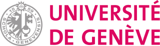

# FreEM corpora

_FreEM corpora_ is a project dealing with Early Modern French (16th-18th c.). It distributes corpora and NLP models for various tasks: named entity recognition, POS tagging, lemmatisation, linguistic normalisation…

The members of the project are:

- Pedro Ortiz Suárez, Inria
- Rachel Bawden, Inria
- Benoît Sagot, Inria
- Philippe Gambette, Université Gustave Eiffel
- Simon Gabay, Université de Genève

Past members of the project are:

- Alexandre Bartz, Sorbonne Université

You feel find on this website all the information about our work. For data and code, please have a look at our [GitHub repo](https://github.com/FreEM-corpora).

   
