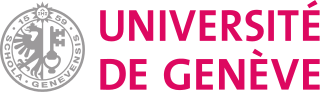

# Publications

## Annotation guide
- Simon Gabay, Jean-Baptiste Camps, Thibault Clérice. Manuel d'annotation linguistique pour le français moderne (XVIe -XVIIIe siècles). 2020. [⟨hal-02571190⟩](https://hal.archives-ouvertes.fr/hal-02571190).

## Datasets

* Gabay, Simon, Philippe Gambette, _FreEM-corpora/FreEMnorm: FreEM norm Parallel corpus (1.0.1)_, Zenodo, 2022. [10.5281/zenodo.5865428](https://doi.org/10.5281/zenodo.5865428).
* Gabay, Simon, Bartz, Alexandre, Gambette, Philippe, & Chagué, Alix, _FreEM-corpora/FreEMmax_OA: FreEM max OA: A Large Corpus for Early modern French - Open access version (1.0.0)_, Zenodo, 2022. [10.5281/zenodo.6481135](https://doi.org/10.5281/zenodo.6481135).
* Gabay, Simon, Thibault Clérice, Matthias Gille Levenson, Jean-Baptiste Camps, Jean-Baptiste Tanguy, _FreEM-corpora/FreEMlpm: FreEM LPM (Lemma, POS-tags, Morphology) corpus (4.0.1)_, Zenodo, 2022, [doi.org/10.5281/zenodo.6481300](https://doi.org/10.5281/zenodo.6481300).

## Articles and conferences
<ol>
<li>Simon Gabay, Philippe Gambette, Rachel Bawden, Benoît Sagot, "Ancien ou moderne? Pistes computationnelles pour l’analyse graphématique des textes écrits au XVIIe s.", _Linx - Revue des linguistes de l'université Paris X Nanterre_, submitted.</li>
<li>Simon Gabay, Rachel Bawden, Philippe Gambette, Jonathan Poinhos, Eleni Kogkitsidou et Benoît Sagot "Le changement linguistique au XVIIe s. : nouvelles approches scriptométriques", _Actes du 8e Congrès Mondial de Linguistique Française_, Jul. 2022, Orléans, France, to be published.</li>
<li>Rachel Bawden, Jonathan Poinhos, Eleni Kogkitsidou, Philippe Gambette, Benoît Sagot, Simon Gabay, "Automatic Normalisation of Early Modern French", _Proceedings of the 13th Language Resources and Evaluation Conference_, European Language Resources Association, Jun 2022, Marseille, France, <a target="_blank" href="https://hal.inria.fr/hal-03540226">⟨hal-03540226⟩</a>.</li>
<li>Simon Gabay, Pedro Ortiz Suarez, Alexandre Bartz, Alix Chagué, Rachel Bawden, et al.. "From FreEM to D'AlemBERT: a Large Corpus and a Language Model for Early Modern French", _Proceedings of the 13th Language Resources and Evaluation Conference_, European Language Resources Association, Jun 2022, Marseille, France, <a target="_blank" href="https://hal.inria.fr/hal-03596653">⟨hal-03596653⟩</a>.</li>
<li>Simon Gabay, Philippe Gambette, Rachel Bawden, Jonathan Poinhos, Eleni Kogkitsidou, et al.. Variation graphique dans les documents d'Ancien Régime : Nouvelles approches scriptométriques. Journée d’étude : « Pour une histoire de la langue ‘par en bas’: textes privés et variation des langues dans le passé », Sep 2021, Paris, France, <a target="_blank" href="https://hal.inria.fr/hal-03357080">⟨hal-03357080⟩</a>.</li>
<li>Alexandre Bartz, Juliette Janès, Laurent Romary, Philippe Gambette, Rachel Bawden, Pedro Ortiz Suarez, Benoît Sagot, Simon Gabay, "Expanding the content model of annotationBlock", _Next Gen TEI, 2021 - TEI Conference and Members’ Meeting_, Oct 2021, Virtual, United States, <a target="_blank" href="https://hal.archives-ouvertes.fr/hal-03380805">hal-03380805</a>.</li>
<li>Jean-Baptiste Camps, Simon Gabay, Paul Fièvre, Thibault Clérice, Florian Cafiero. Corpus and Models for Lemmatisation and POS-tagging of Classical French Theatre. Journal of Data Mining and Digital Humanities, Episciences.org, 2021, <a target="_blank" href="https://dx.doi.org/10.46298/jdmdh.6485">⟨10.46298/jdmdh.6485⟩</a>, <a target="_blank" href="https://halshs.archives-ouvertes.fr/halshs-02591388v2">⟨halshs-02591388v2⟩</a>.</li>
<li>Simon Gabay, Thibault Clérice, Jean-Baptiste Camps, Jean-Baptiste Tanguy, Matthias Gille-Levenson. Standardizing linguistic data: method and tools for annotating (pre-orthographic) French. Proceedings of the 2nd International Digital Tools & Uses Congress (DTUC '20), Oct 2020, Hammamet, Tunisia, <a target="_blank" href="https://dx.doi.org/10.1145/3423603.3423996">⟨10.1145/3423603.3423996⟩</a>, <a target="_blank" href="https://hal.archives-ouvertes.fr/hal-03018381">⟨hal-03018381⟩</a>.</li>
<li>Simon Gabay, Loïc Barrault. Traduction automatique pour la normalisation du français du XVIIe siècle. TALN 2020, ATALA, Jun 2020, Nancy, France, <a target="_blank" href="https://hal.archives-ouvertes.fr/hal-02596669">⟨hal-02596669⟩</a>.</li>
<li>Simon Gabay, Marine Riguet, Loïc Barrault. A Workflow For On The Fly Normalisation Of 17th c. French. DH2019, ADHO, Jul 2019, Utrecht, Netherlands, <a target="_blank" href="https://hal.archives-ouvertes.fr/hal-02276150">⟨hal-02276150⟩</a>.</li>

   
